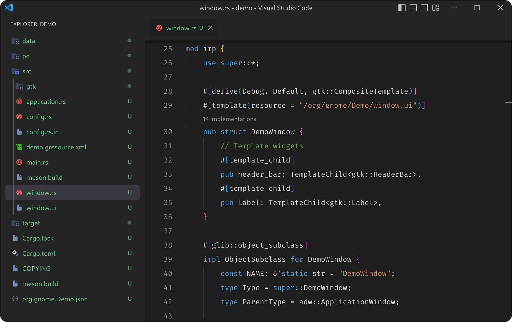
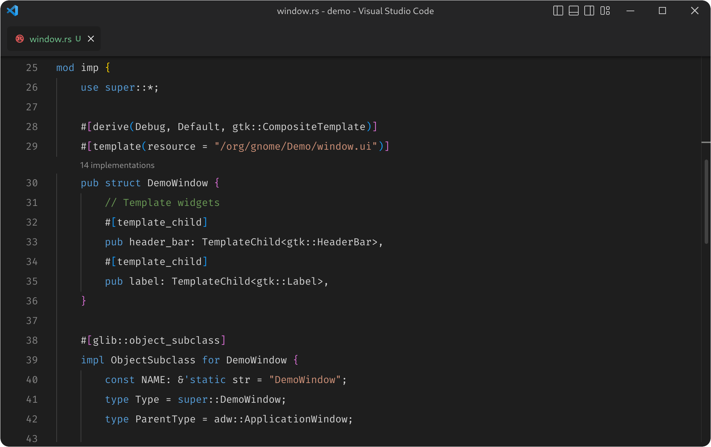
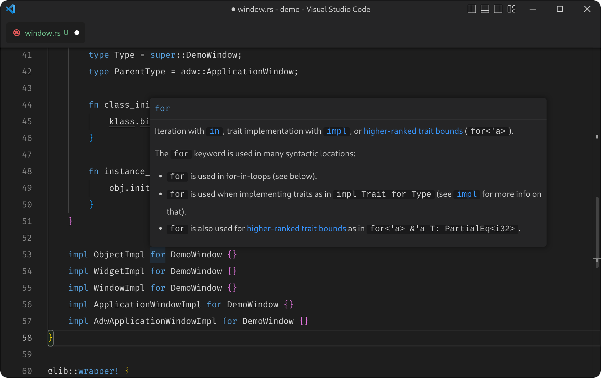
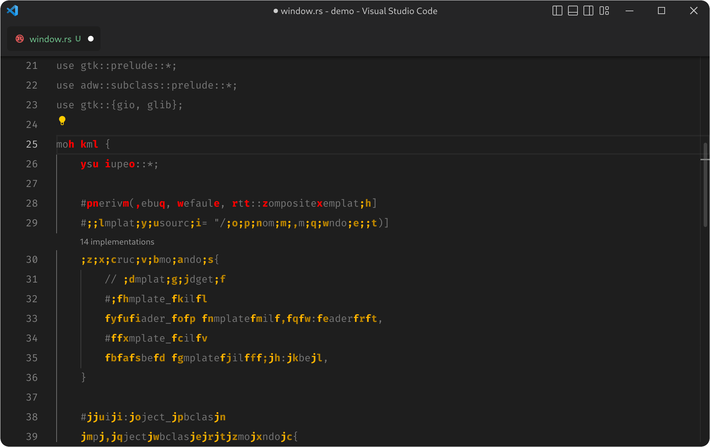
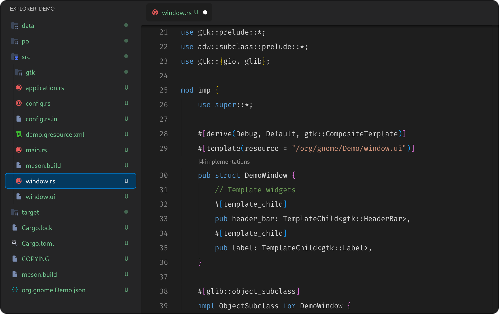
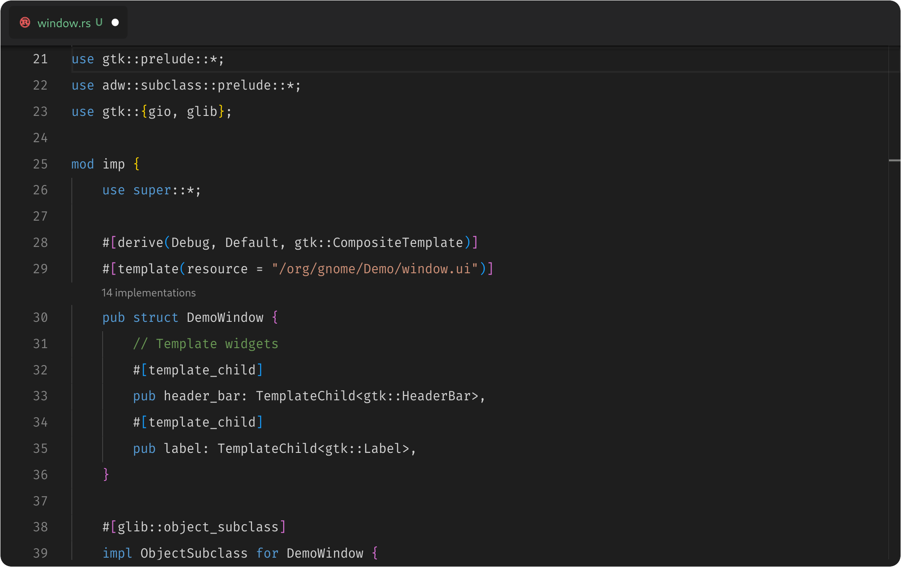
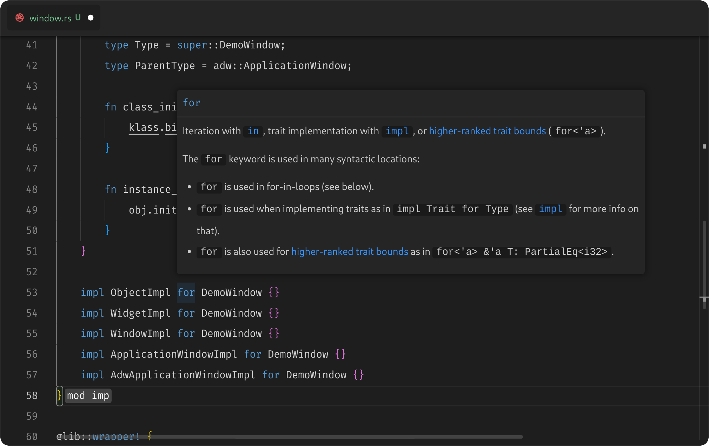
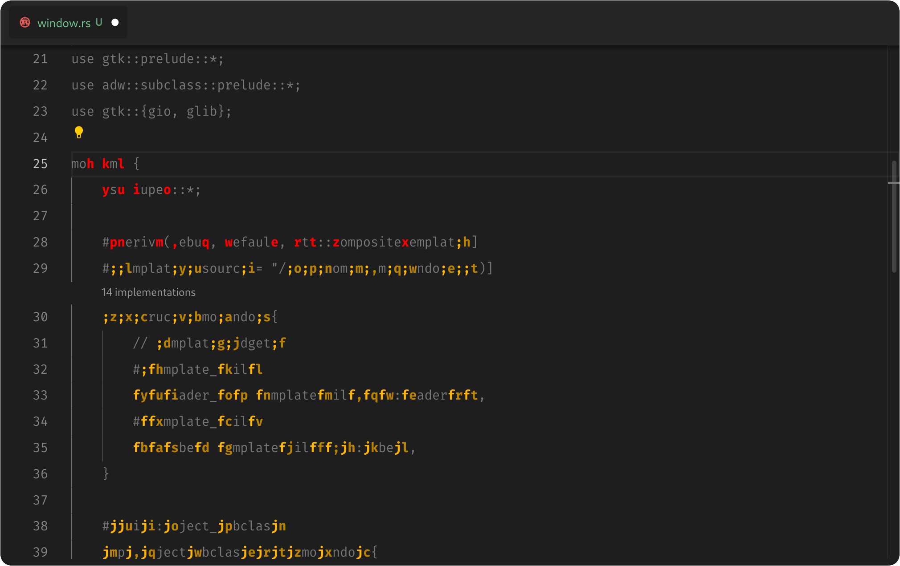

# Visual Studio Code for the GNOME platform.

This theme was designed for my personal use. Therefore, I made engineering and design decisions that only fit my own needs. If you use it, you should probably fork it and adapt it to your personal use if you don't want any surprising changes. That said, PRs are welcome if you decide to improve it! 🎉 

*Note: you can uncomment the CSS code to remove the title bar, but the vscode contains automatic calculations that add padding to the bottom of the page, and the current band-aid solution from this theme is not sufficient.*

## Installation

1. Clone the project.

2. Install the [Custom CSS and JS Loader](https://marketplace.visualstudio.com/items?itemName=be5invis.vscode-custom-css) extension from the Visual Studio Code Marketplace. Make sure to follow its instructions so that VS Code has permission to patch itself.

3. Add the following line to your VS Code `settings.json`, replacing `/path/to/vscode-gnome` with the full path to the directory you cloned the project to:

(*optional*): 

4. Install [Moxer Icons](https://marketplace.visualstudio.com/items?itemName=Equinusocio.moxer-icons) and [Customize UI](https://marketplace.visualstudio.com/items?itemName=iocave.customize-ui) extension from the Visual Studio Code Marketplace. Make sure to follow its instructions so that VS Code has permission to patch itself.

5. Copy the repository settings.json to your own settings.json.

## Screenshots

    
    
    
    
    
    
    
    

