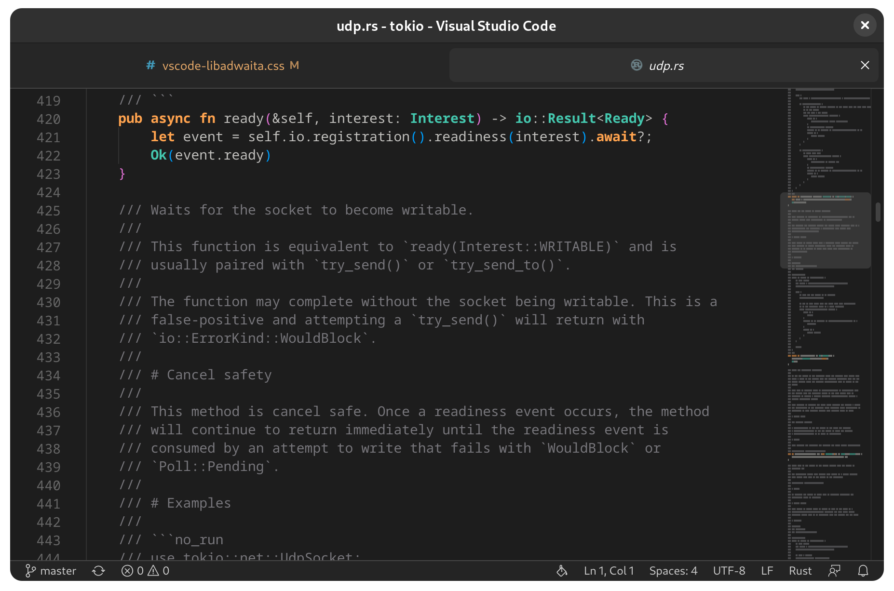

# Libadwaita theme for Visual Studio Code.

If you're interested in using this theme, I'd recommend forking it and making it your own so that it fits your personal needs. However, if you do make any changes or improvements to the theme, I'd be more than happy to review and potentially merge your pull request. Thanks for considering this theme! 🎉

## Installation

1. Clone the project.

2. Install the [Custom CSS and JS Loader](https://marketplace.visualstudio.com/items?itemName=be5invis.vscode-custom-css) extension from the Visual Studio Code Marketplace. Be sure to follow its instructions so that VS Code has permission to patch itself.

3. Add the following line to your VS code `settings.json`, replacing `file:///home/username/vscode-libadwaita/vscode-libadwaita.css` with the full path to the directory where you cloned the project.

## Bonus

If you're looking for a great theme to use with this, I'd highly recommend checking out [vscode-adwaita](https://github.com/piousdeer/vscode-adwaita.git). It's an amazing piece of work by [@piousdeer](https://github.com/piousdeer)! :)
