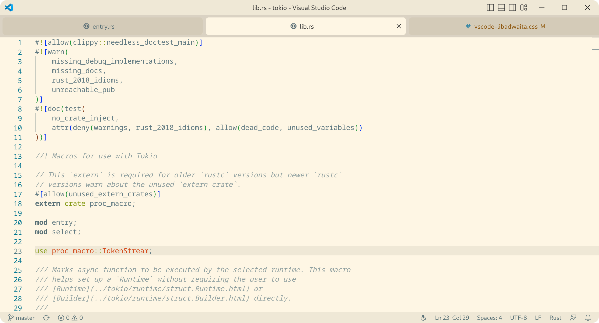
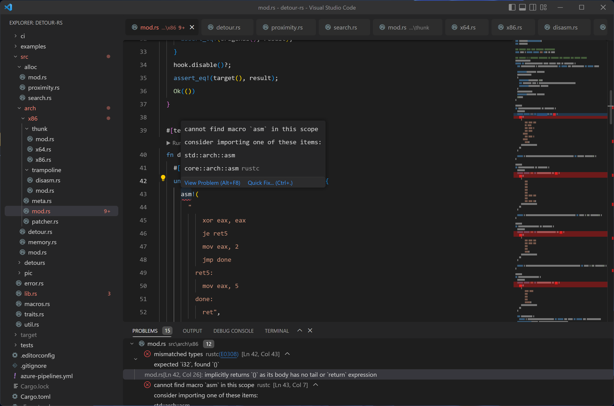

# Visual Studio Code with rounded corners for all elements and icons.

This theme was designed for my personal use. If you use it, you should probably fork it and adapt it to your personal use. That said, PRs are welcome if you decide to improve it! 🎉

> **Note**
> You can inline the titlebar by uncommenting #workbench\.parts\.titlebar, but you will lose the ability to drag the window.

## Installation

1. Clone the project.

2. Install the [Custom CSS and JS Loader](https://marketplace.visualstudio.com/items?itemName=be5invis.vscode-custom-css) extension from the Visual Studio Code Marketplace. Be sure to follow its instructions so that VS Code has permission to patch itself.

3. Add the following line to your VS code `settings.json`, replacing `/path/to/vscode-rounded` with the full path to the directory where you cloned the project:

(*optional*): 

4. Install the [Moxer Icons](https://marketplace.visualstudio.com/items?itemName=Equinusocio.moxer-icons) and [Customize UI](https://marketplace.visualstudio.com/items?itemName=iocave.customize-ui) extension from the Visual Studio Code Marketplace. Be sure to follow its instructions so that VS Code has permission to patch itself.

5. Copy the settings.json file from the repository into your own settings.json file.

## Screenshots

> **Warning**
> These screenshots may be old and may not represent the latest updates.

    
    
    
    
    
    
    
    
    
    

